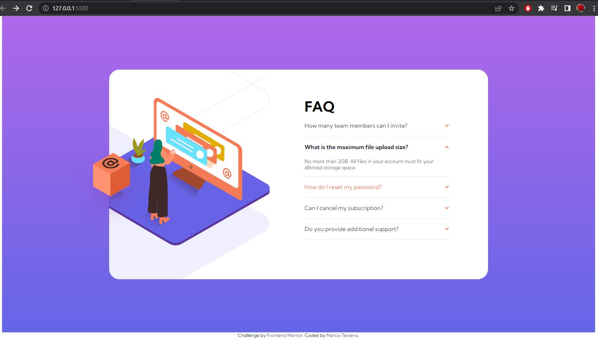

# Frontend Mentor - FAQ accordion card solution

This is a solution to the [FAQ accordion card challenge on Frontend Mentor](https://www.frontendmentor.io/challenges/faq-accordion-card-XlyjD0Oam). Frontend Mentor challenges help you improve your coding skills by building realistic projects. 

## Table of contents

- [Overview](#overview)
  - [The challenge](#the-challenge)
  - [Screenshot](#screenshot)
  - [Links](#links)
- [My process](#my-process)
  - [Built with](#built-with)
  - [What I learned](#what-i-learned)
  - [Continued development](#continued-development)
  - [Useful resources](#useful-resources)
- [Author](#author)

## Overview

### The challenge

Users should be able to:

- View the optimal layout for the component depending on their device's screen size
- See hover states for all interactive elements on the page
- Hide/Show the answer to a question when the question is clicked

### Screenshot




### Links

- Solution URL: [Frontedmentor Challenge Page](https://your-solution-url.com)
- Live Site URL: [Git Pages](https://marcioufrj.github.io/challenge-newbie-faq-accordion-card/)

## My process

### Built with

- Semantic HTML5 markup: {picture, img}
- CSS custom properties: Position, Object-fit, Object-position
- Flexbox
- JavaScript

### What I learned

How to use HTML to dynamically select the image's source.
How to use CSS to position a image.

```html
<picture>
  <source media="(min-width: 440px)" srcset="./images/bg-pattern-desktop.svg">
  
</picture>
```
```css
.img-big-pattern {
  /* image configuration */
  overflow: hidden;
  width: 100%;
  height: 100%;
  object-fit: none;
  object-position: right -300px;
  /* image position */
  position: absolute;
  right: 0;
  top: 0;
}
```

### Continued development

Coding the JavaScript code to add the "event listener" was a such a pain in the neck. I'm new to JavaScript and I need to study a lot more to be more confortable with it.

### Useful resources

- [CSS Object-fit](https://www.w3schools.com/css/css3_object-fit.aspm) - Helped to configure how an image fit within it's frame.
- [CSS Object-position](https://www.w3schools.com/css/css3_object-position.asp) - Helped to position the images' frames within it's frame.
- [CSS Position](https://www.w3schools.com/css/css_positioning.asp) - Helped to position an container within it's parent container.

## Author

- Frontend Mentor - [@marcioUfrj](https://www.frontendmentor.io/profile/marcioUfrj)
- Twitter - [@tsukimi_23](https://www.twitter.com/tsukimi_23)